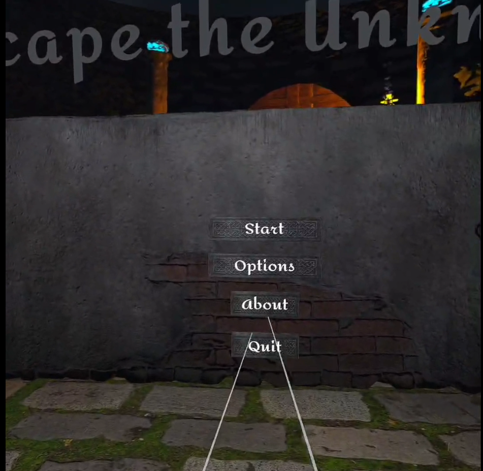
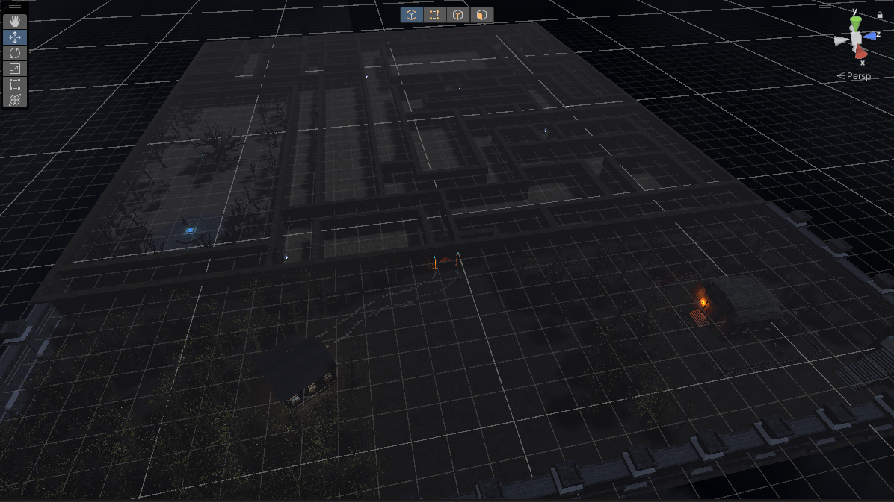
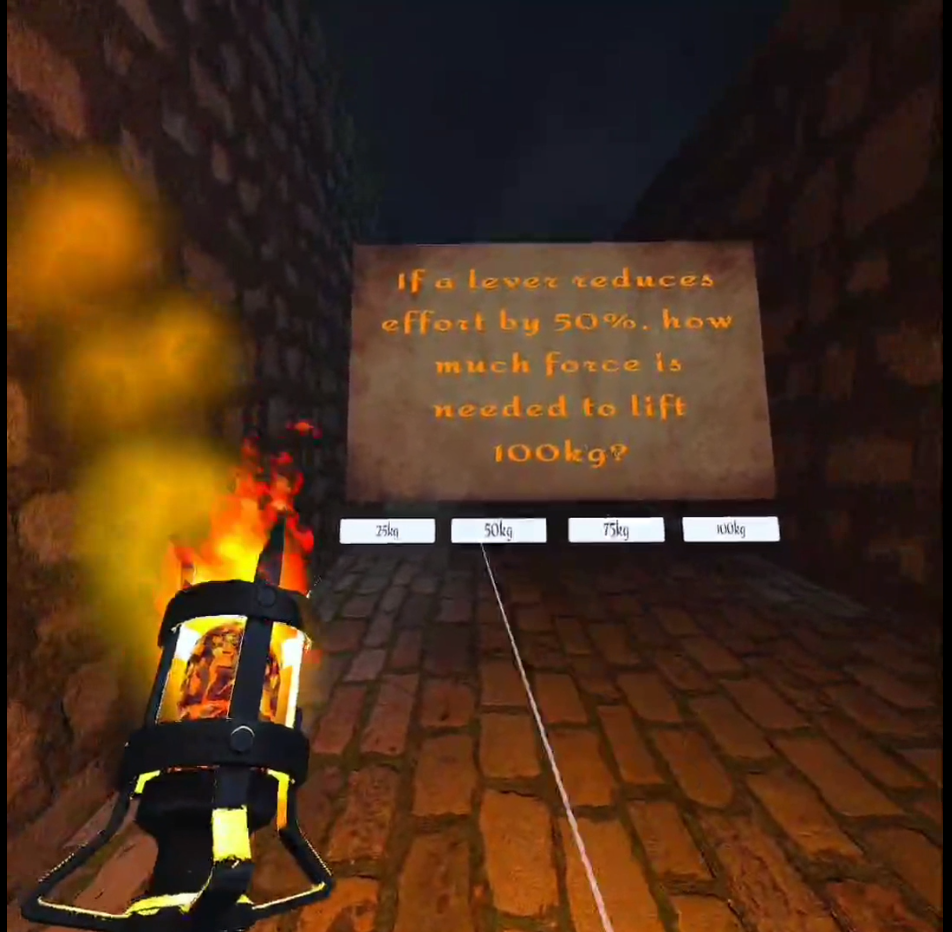
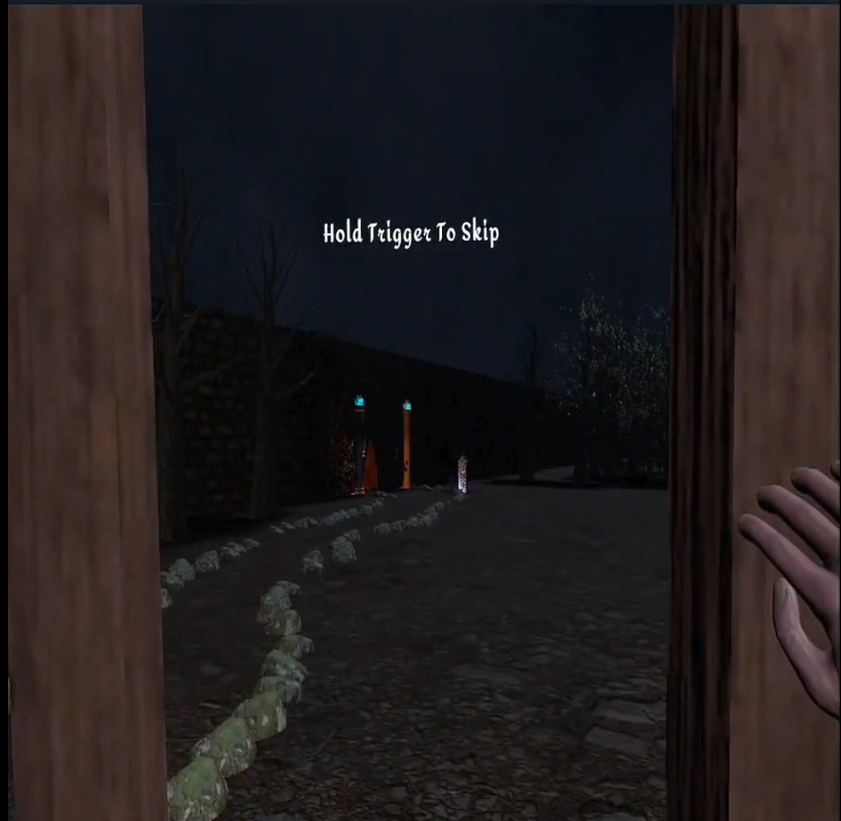

# Escape the Unknown

> A first-person psychological horror maze game built in Unity, where memory, perception, and silence are the real puzzles.

> **This is a portfolio showcase.** The full Unity project source is kept private — this repository contains the README, the final report, screenshots, and the demo video. Email me if you'd like access to the project for review.

## Description

**Escape the Unknown** is a story-driven, single-player psychological horror game set inside a labyrinth that responds to the player's choices. The player wakes with no memory in an oppressive maze and must solve environmental puzzles — runes, energy orbs, obelisks, ritual stones — to piece together what happened and find a way out. The game leans on atmosphere, voice acting, and Timeline-driven cutscenes rather than combat, with a narrative loop ("New Cycle") that reframes earlier areas as the player learns more.

It was designed and built end-to-end as an individual project: concept, level design, scripting, audio direction, and integration.

## Tech Stack

| Category | Tool / Version |
|---|---|
| Engine | Unity 2022.3.56f1 LTS |
| Render Pipeline | Universal Render Pipeline (URP) |
| Language | C# |
| XR Framework | Unity XR Interaction Toolkit |
| Cutscenes | Unity Timeline + Signals |
| Audio | Unity Audio + custom AudioManager |
| 3D / Assets | Mixamo characters, custom maze, curated asset imports |
| IDE | JetBrains Rider / Visual Studio |
| Version Control | Git |

## Key Features

- **Story-driven horror loop** — six interconnected scenes (`MainMenu → MainScene → CutsceneScene → NewCycle → FinalCutscene → FinalScene`) sequenced by a custom `SceneTransitionManager` with a screen-fade controller, so transitions feel like memory cuts rather than scene loads.
- **Timeline-driven cutscenes** — each narrative beat is authored as a Unity Timeline asset with video playback (`StreamingAssets/CutScene.mp4`), bound voice lines, and Signal Receivers that trigger gameplay events; a `SkipCutscene` system honors player input without breaking subsequent state.
- **Puzzle systems in three flavors** — *quiz stones* (`QuizStone`, `VRLeverController`), an *energy-orb + obelisk* ritual chain (`EnergyOrb`, `OrbHolder`, `ObeliskEvent`, `PillarSummon`, `FloatingStones`), and *rune interaction* (`RuneInteraction`, `RuneGlow`) — each gated by `OneWayDoor` and clue panels.
- **VR-ready interaction layer** — built on Unity's XR Interaction Toolkit with a custom `xrGrabInteractableTwoAttach` for two-handed grabbing, `HapticsManager` for tactile feedback, and a hand-menu affordance for in-VR options.
- **Atmospheric systems** — `LightFlicker` for unstable lighting, `WhisperTrigger` + `WhisperSound` for proximity-driven ambient voices, `EyeOpenEffect` and `FadeScreen` for first-person disorientation moments, and a `TrapDoorManager` that swallows the player into the next narrative beat.
- **In-VR options menu** — `MenuManager`, `OptionsManager`, `VolumeManager`, `SettingsManager` provide a settings stack the player can summon mid-run via the hand menu without exiting to the main menu.
- **Custom audio direction** — a centralized `AudioManager` plus recorded voicelines (`Parols.txt`, `Voicelines/`) drive the narration; `PlaySoundOnCollision` ties props into the soundscape diegetically.
- **Designed and produced solo** — game design document, system architecture, scripting, voice direction, and report all by one author.

## Screenshots

| | |
|---|---|
|  |  |
|  |  |

> Drop your four chosen screenshots into `docs/screenshots/` using exactly the filenames above (`main-menu.png`, `maze-interior.png`, `puzzle-room.png`, `cutscene.png`) and they'll render automatically.

## Demo

▶ **[Watch the gameplay demo](VIDEO_URL_HERE)**

> Replace `VIDEO_URL_HERE` with your YouTube link once uploaded. Reminder: a video shorter than 60 s or square/vertical will be auto-classified as a Short and can't be converted afterwards — re-encode to 16:9 / >60 s before upload if you want a regular video.

## Project Report

The full PFA report covering design rationale, system architecture, sprint plan, and post-mortem is included here:

📄 **[`docs/RapportFinal.pdf`](docs/RapportFinal.pdf)**

## Source Code Access

The Unity project source (scenes, prefabs, scripts, assets) is kept in a private repository because the build directory exceeds GitHub's size limits and includes third-party assets that are licensed for use but not for public redistribution.

For a code walkthrough, technical review, or evaluation copy, please email **anwerbouharb01@gmail.com**.

## Credits

- **Project:** PFA (Projet de Fin d'Année) — individual project, concept, design, scripting, and audio direction by Anwer Bouharb.
- **Engine & tooling:** Unity Technologies (Unity 2022.3 LTS, XR Interaction Toolkit, URP, Timeline).
- **Character rigs:** Mixamo (Adobe).
- **3D assets:** curated mix of marketplace and Sketchfab imports (ancient book, headstone, signboards, willow, gates, etc.) integrated and re-textured for the maze setting.
- **Voice lines:** recorded and directed by the author.

## License

The contents of **this showcase repository** (README, screenshots, report) are released under the [MIT License](LICENSE).

The underlying Unity project source, art assets, and recorded audio are **All Rights Reserved** and are not included in this repository.

---

*Author: Anwer Bouharb · 2026*
